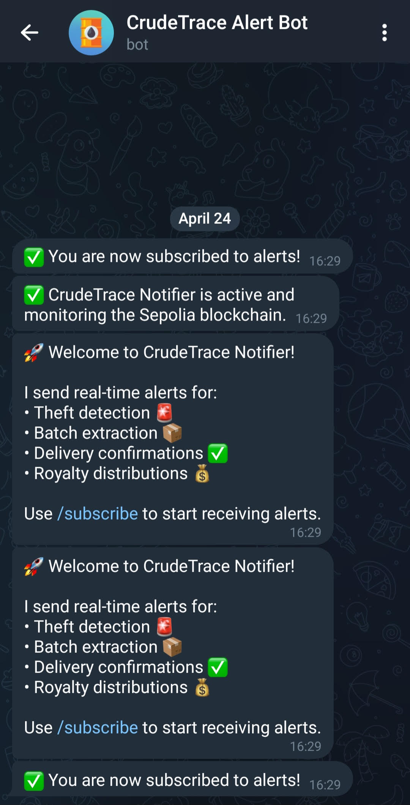
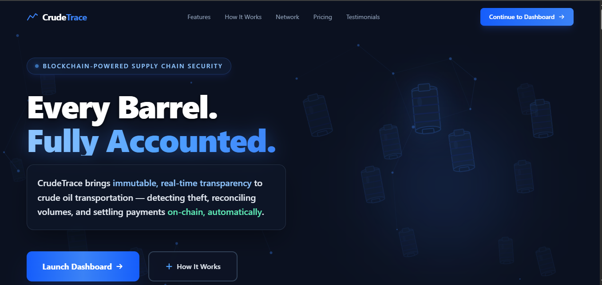

# CrudeTrace

A comprehensive blockchain-based crude oil supply chain tracking system with Web2 API integrations for real-time notifications and enterprise connectivity.

## Architecture

- **Smart Contracts**: Solidity contracts deployed on Sepolia testnet
- **Frontend**: React + Vite dashboard with MetaMask integration
- **Web2 API Engine**: Node.js notification service with Telegram bot and webhooks
- **Real-time Monitoring**: WebSocket streaming and event-driven notifications

## Components

### Core System
- `cudetrace_smartcontract/` - Solidity contracts for supply chain logic
- `crudetrace_frontend/` - React dashboard for operations and monitoring

### Web2 API Integration ⭐
- `crudetrace_notifier/` - **NEW**: Node.js service providing:
  - Telegram bot for instant notifications
  - REST webhooks for external system integration
  - WebSocket server for real-time event streaming
  - Blockchain event monitoring and alerting

## Web2 API Features

### Telegram Notifications
- 🚨 Real-time theft alerts
- 📦 Batch extraction notifications
- ✅ Delivery confirmations
- 💰 Royalty distribution updates

**See the bot in action:**




**See the bot in action:**




### Webhook Integration
- REST API endpoints for ERP systems
- External monitoring tools integration
- Custom alert forwarding

### WebSocket Streaming
- Real-time event broadcasting
- Frontend live updates
- Third-party application integration

## Quick Start

1. **Deploy Smart Contracts** (see contract README)
2. **Setup Frontend** (see frontend README)
3. **Configure Notifier Service**:
   ```bash
   cd crudetrace_notifier
   npm install
   cp .env.example .env
   # Configure Telegram bot and RPC endpoint
   npm run build && npm start
   ```

## For Judges 🎯

**Want to experience the full CrudeTrace platform in 10 minutes?**

See [JUDGING_GUIDE.md](./JUDGING_GUIDE.md) for a complete step-by-step walkthrough including:
- How to setup and connect MetaMask
- How to grant yourself oracle roles
- How to create test batches
- How to see Web2 API integration in action
- How to receive Telegram notifications

**TL;DR - Quick Commands:**

```bash
# Terminal 1: Start the frontend
cd crudetrace_frontend && npm run dev

# Terminal 2: Start the Web2 API service
cd crudetrace_notifier && npm start

# Then visit http://localhost:5173 and see the bot section on landing page
```

## Web2 API Integration

This project demonstrates **hybrid Web2-Web3 architecture** with:

- **Telegram Bot API**: Real-time stakeholder notifications
- **Webhook Engine**: Enterprise system integration capabilities
- **WebSocket Server**: Live data streaming for external applications
- **Event-Driven Architecture**: Blockchain events trigger Web2 notifications

The notifier service runs independently, monitoring the blockchain and providing traditional API interfaces for supply chain stakeholders who prefer Web2 integrations over direct blockchain interaction.

CrudeTrace is an immutable Web3 supply chain tracking and automated settlement platform designed for the crude oil industry. It connects IoT terminal data directly to smart contracts to trace shipments, calculate losses, and automatically distribute royalties to stakeholders without human intervention or intermediaries.

---

### 1. Why does our product specifically need Kwala to function?
CrudeTrace requires reliable, un-bribable on-chain automation. When an oil terminal registers a successful delivery via our dashboard (simulating an IoT node), the smart contract emits a `DeliveryConfirmed` event. Kwala listens to this exact event and automatically fires the `distributeRoyalties` function. Without Kwala, human administrators would have to manually execute the payout transactions, re-introducing the exact delays, trust issues, and vulnerabilities we are trying to eliminate. 

### 2. How deeply does our project use Kwala?
Kwala acts as the central settlement engine of our architecture. The entire financial lifecycle of a crude oil batch relies on Kwala. Our YAML configuration (`crudetrace.yaml`) dictates that Kwala monitors the Sepolia contract and utilizes a Kwala **Smart Wallet** (`0xb71577a4758f0e19a86e4c04fec3ee43778dad76`) to securely and autonomously finalize the transaction by calling the distribution function. 

### 3. Is it solving a real problem?
Absolutely. In many oil-producing developing nations (like Nigeria), the supply chain between the extraction wellhead and the export terminal is highly opaque. Significant volumes of oil "vanish" in transit due to pipeline vandalism, theft (bunkering), and misreporting. Furthermore, the local communities whose lands are drilled rarely see their legally promised royalties on time, leading to regional instability. CrudeTrace solves both supply chain opacity and financial trust.

### 4. How to run it
To test and interact with the deployed CrudeTrace dashboard:
1. Clone the repository and navigate to the frontend directory:
   ```bash
   cd crudetrace_frontend
   ```
2. Install the necessary dependencies:
   ```bash
   npm install
   ```
3. Start the local development server:
   ```bash
   npm run dev
   ```
4. **Usage Instructions**:
   - Open your browser to `http://localhost:5173`.
   - Ensure you have **MetaMask** installed and switch to the **Sepolia Testnet**.
   - Navigate to the **Operations** tab. Use the **Wellhead Console** to simulate loading a batch of oil (e.g. Batch `600`, 1000 barrels, $75000 value).
   - Use the **Terminal Console** to confirm delivery of that batch (e.g. 990 barrels).
   - Once delivery is confirmed, Kwala will detect the event and automatically distribute the USDC royalties. 
   - Check the **Dashboard** to see the interactive ledger and calculated barrel deficits!
   - **Admin & Treasury Controls**: Navigate to the **Admin & Treasury** tab. If your wallet holds the `DEFAULT_ADMIN_ROLE` (contract deployer), you can use this panel to:
     - **Manage Access**: Grant or revoke specific Oracle roles (`WELLHEAD_ORACLE`, `TERMINAL_ORACLE`, `AUTOMATION_ROLE`) to other Ethereum addresses.
     - **Emergency Kill Switch**: Pause or Unpause all global contract operations instantly if a physical or digital threat is detected.
     - **Fund the Treasury**: Transfer MockUSDC directly from your MetaMask wallet to the CrudeTrace contract so it has the liquidity required to automatically pay out the royalties.

### 5. What does your project do?
It creates a mathematically verifiable ledger for oil batches. An oracle logs exactly how many barrels were extracted at the wellhead, along with the batch's USD value. When the batch arrives at the terminal, the received volume is logged. The contract calculates any deficit/theft and emits alerts. Finally, it autonomously splits the batch's financial value into predefined royalty pools (e.g., 50% Federal, 30% State, 20% Community) using MockUSDC.

### 6. Why did you build it the way you did?
We separated the architecture into three pillars:
- **The Dashboard**: A responsive React + Vite UI acting as a "Wizard of Oz" simulator for field IoT nodes.
- **The Smart Contract**: A Solidity contract handling Role-Based Access Control (RBAC) so only authorized nodes can log data.
- **The Automation**: Kwala handles the execution layer, separating the "reporting" of data from the "financial settlement" of data to maintain security.

### 7. Is there a real user, a real problem, and a real path to revenue?
Yes. The real users are National Oil Companies (NOCs), Government Treasuries, and local Community Trust funds. The problem is institutional distrust and physical theft. The path to revenue involves charging a small SaaS subscription to the oil operators for access to the enterprise portal, or a fractional basis point fee on the royalties distributed through the protocol.

### 8. Quantify the problem
Oil theft and pipeline vandalism in regions like the Niger Delta cost the local economy an estimated **$3.3 billion to $10 billion annually**. Over **400,000 barrels** are stolen or unaccounted for per day. The resulting environmental damage and delayed community compensation create massive socio-economic instability.

### 9. Who are the users?
- **Federal Regulators & State Governments**: Seeking transparent tax and royalty collection.
- **Local Communities**: Seeking immediate, guaranteed payouts to their Trust Wallets without government delays.
- **Oil Terminal Operators**: The ground workers interacting with the system to log flow-meter data.

### 10. How do we plan to monetize?
We plan to operate as a B2B infrastructure provider. Revenue streams include:
1. **SaaS Licensing**: Charging oil corporations a monthly licensing fee for node access and dashboard analytics.
2. **Transaction Fees**: Taking a microscopic protocol fee (e.g., 0.05%) on the total MockUSDC routed through the automated royalty splits.

### 11. Why use Web3 to build CrudeTrace? Why now?
Web3 provides the only viable trustless infrastructure for parties that historically do not trust each other (Governments, Corporations, and Citizens). A centralized Web2 database could be easily altered by a corrupt administrator to hide stolen barrels. A smart contract creates an immutable ledger that everyone can audit but no one can secretly alter. With the maturation of stablecoins (USDC) and reliable automation networks (Kwala), the technology is finally ready for industrial supply chains.

### 12. Did we use multiple workflows? Cross chain? Smart wallets? Web 2 API's?
- **Smart Wallets**: Yes, we leveraged Kwala's Smart Wallet architecture (`0xb71577a4758f0e19a86e4c04fec3ee43778dad76`) to securely execute the royalty distribution.
- **YAML Workflows**: Our complete automation pipeline is defined in `crudetrace.yaml`, listening to the Sepolia chain and instantly reacting to `DeliveryConfirmed` events.